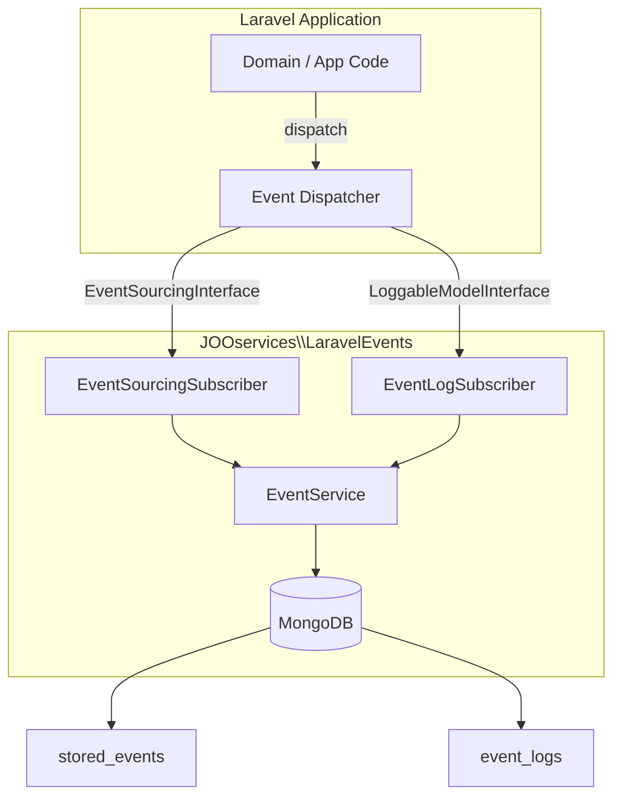
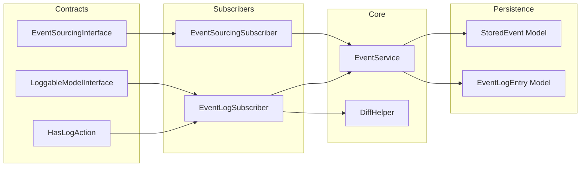
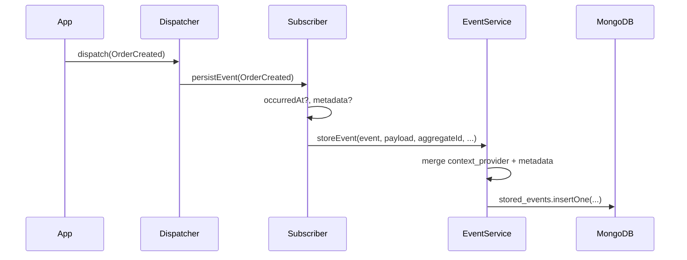
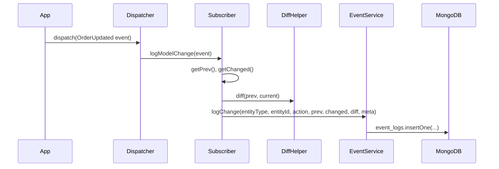

# Architecture

## Overview

Laravel Events integrates with Laravel's event system. When you dispatch events that implement the package interfaces, **subscribers** listen and persist them to MongoDB via the **EventService**. Two persistence modes are supported: **EventSourcing** (event payloads by aggregate) and **EventLog** (model change audit with prev/changed/diff).

The package boundary is intentionally small: it persists event records and log entries. It does not replace Laravel's dispatcher, run projections/read models, provide analytics/reporting, or provide AI data access.

## High-Level Architecture

## Component Diagram

## Data Flow: Event Sourcing

## Data Flow: Event Log (Audit)

## MongoDB Collections

| Collection | Purpose | Key Fields |
|------------|---------|------------|
| **stored_events** | Event Sourcing: event payloads by aggregate | `event_class`, `aggregate_id`, `payload`, `metadata`, `user_id`, `occurred_at`, `created_at` |
| **event_logs** | Event Log: model change audit | `entity_type`, `entity_id`, `action`, `prev`, `changed`, `diff`, `meta`, `user_id`, `created_at` |

## Design Decisions

- **Laravel events:** Uses native `Dispatcher`; no custom bus. Enables middleware, queuing, and testing with Laravel's tools.
- **MongoDB:** Chosen for flexible schema, scalability, and TTL support for retention policies.
- **Single EventService:** Both features use one service and one MongoDB connection for consistency and configuration.
- **Context provider:** Optional callable injects request-scoped metadata (e.g. `request_id`, `channel`) into every stored record.
- **Conventions over enforcement:** Metadata, versioning, correction links, and action taxonomy are documented conventions with small helpers, not rigid runtime validation.
